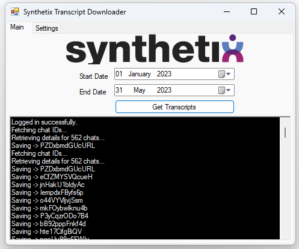
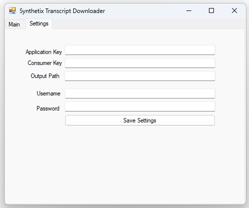

# Synthetix Transcript Downloader (Unofficial)

Synthetix Transcript Downloader is an unofficial application that allows you to fetch and save chat transcripts from the Synthetix platform.

## Installation

You can install the application by following these steps:

1. Download the installation file from the [Installer](./Installer/setup.exe) directory.
2. Run the setup.exe file.
3. Follow the on-screen instructions to complete the installation process.

## Usage

1. Launch the Synthetix Transcript Downloader application.
2. Enter your Synthetix credentials and API keys in the Settings tab. (Note that you should use a service account otherwise, you will need to login on the console first to avoid MFA. Speak to your account manager about getting a service account)
3. Click the "Save" button to save your settings.
4. Go back to the Main tab and select the date range you wish to capture date from.
5. Click the "Get Transcripts" button to log in and fetch the chat IDs.
6. The chat IDs will be displayed in the log window.
7. The application will automatically download and save the transcripts for each chat ID.
8. The saved transcripts will be stored in the specified output path.

## Configuration

The application uses a settings file (settings.json) to store your configuration. You can find this file in the same directory as the executable. You can modify the settings directly by opening the file in a text editor.

## Contributing

Contributions are welcome! If you have any bug reports, feature requests, or code improvements, feel free to open an issue or submit a pull request.

## Disclaimer

This application is not affiliated with or endorsed by Synthetix. It is an unofficial tool developed by [HairyDuck] for personal use.

## Writing Your Own Application

If you want to develop your own application or integrate the functionality of Synthetix Transcript Downloader into your existing project, you can follow this flow to understand the logic behind the process:

1. Establish an HTTP client to communicate with the Synthetix API.
2. Implement the login functionality by sending a POST request to the login endpoint (`https://api.synthetix.com/2.0/internal/profile`) with the necessary headers and form data (`usrname` and `passwd`).
3. Upon successful login, retrieve the bearer token from the response.
4. Use the obtained bearer token and required headers (`APPLICATIONKEY` and `CONSUMERKEY`) to authenticate subsequent API requests.
5. Send a GET request to the chat IDs endpoint (`https://api.synthetix.com/2.0/internal/chatids`) with the desired parameters, such as start and end dates, to fetch the chat IDs.
6. Process the response to obtain the list of chat IDs.
7. For each chat ID, send a POST request to the details endpoint (`https://api.synthetix.com/2.0/livechat/details`) with the chat ID in the request payload to retrieve the chat details.
8. Handle the response and save the chat details, such as the JSON response, to the desired location.
9. Repeat the process for each chat ID retrieved in step 6.

By following this flow and understanding the underlying logic, you can customize and build your own application to interact with the Synthetix API and implement specific functionalities based on your requirements.

Please note that the provided code in this repository serves as a reference implementation, and you should adapt it to suit your specific use case and application architecture.

## Note

Before using the Synthetix API for your own application, you need to acquire the necessary application and consumer keys from your Synthetix account manager. Additionally, please note that your application will be subject to approval by Synthetix staff. During the development and testing phase, it is recommended to use the Staging environment. Once your application is approved, you can switch to the production environment.

## License

This project is licensed under the [MIT License](./LICENSE).
