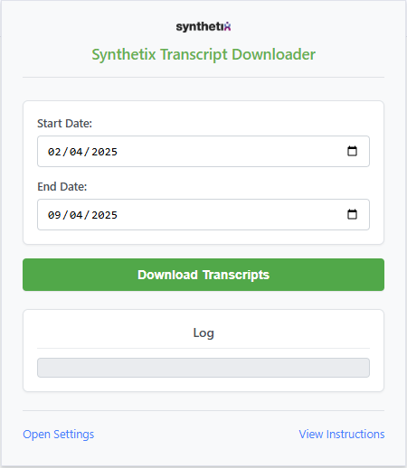
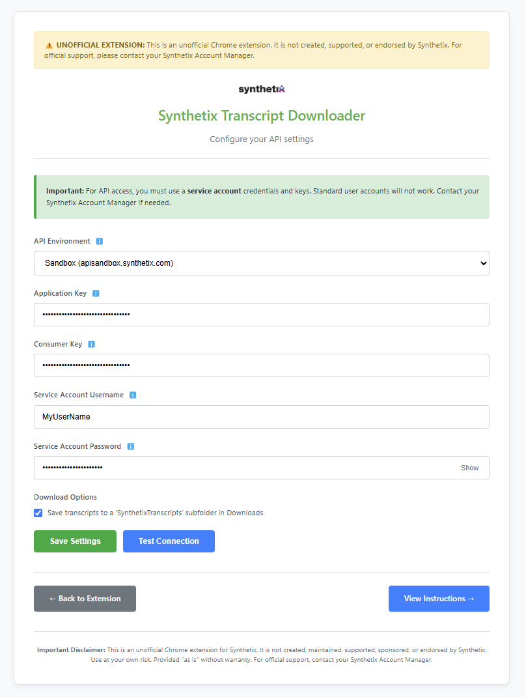
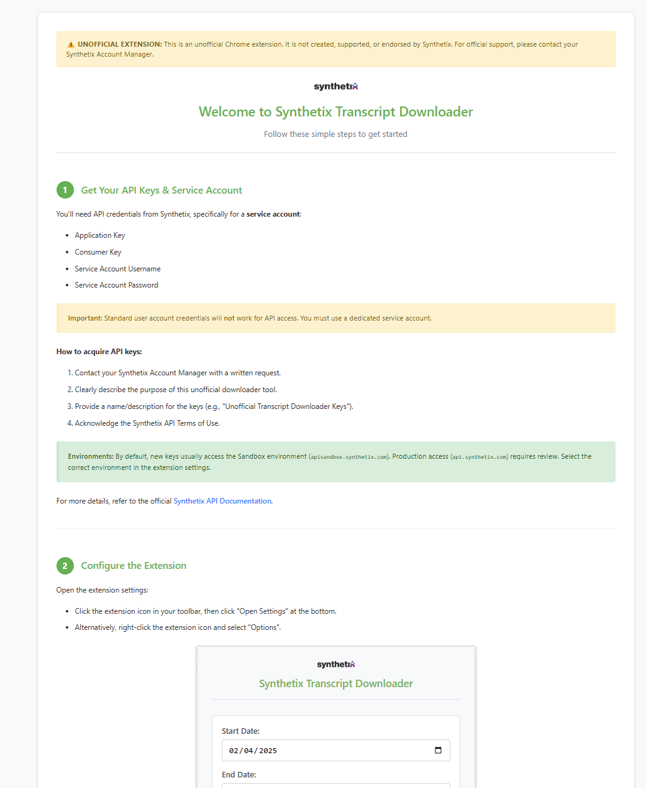

# Synthetix Transcript Downloader (Unofficial)

**⚠️ Important Disclaimer:** This is an unofficial Chrome extension developed independently. It is **not** created, maintained, supported, sponsored, or endorsed by Synthetix or any of its affiliates or subsidiaries. Use this extension at your own risk. For official Synthetix support and features, please contact your Synthetix Account Manager.

---

## Overview

This Chrome extension enables users with valid Synthetix API credentials (**Service Account required**) to download chat transcripts for specified date ranges.

## Key Features

*   Download transcripts by date range.
*   Select Synthetix API environment (Production, Staging, Sandbox).
*   Secure local storage for API credentials.
*   Test connection functionality within settings.
*   Optional download to a `SynthetixTranscripts` subfolder.
*   In-extension progress logging.
*   Built-in instructions page (opens automatically on first run).

---

## Installation

There are two ways to install the extension:

### 1. From Browser Stores (Recommended)

*   **Chrome:** [Install from Chrome Web Store](https://chromewebstore.google.com/detail/ndcacfbnjlggoolaginndlpdmkpomjba)
*   **Firefox:** [Install from Firefox Add-ons](https://addons.mozilla.org/en-GB/firefox/addon/synthetix-transcript-download/)

### 2. Manual / Developer Install

1.  Download or clone this repository.
2.  Open Chrome, go to `chrome://extensions/`.
3.  Enable "Developer mode" (top-right corner).
4.  Click "Load unpacked" and select the `Chrome` folder from this repository.

---

## Getting Started (Quick Start)

1.  **Install** the extension (see above).
2.  **Open Settings:** Click the extension icon > "Open Settings" (or right-click icon > Options).
3.  **Configure:** Enter your **Service Account** API keys/credentials and select the correct API Environment. Use "Test Connection" to verify.
4.  **Save Settings.**
5.  **Download:** Open the extension popup, select dates, and click "Download Transcripts".

*For detailed setup steps, please refer to the Instructions page that opens automatically when the extension is first installed, or access it via the link in the popup.* 

---

## Screenshots

*   Popup Interface:
    
*   Settings Page:
    
*   Instructions Page:
    

---

## Common Troubleshooting

*   **Login Failed / Invalid Credentials:** Verify all credentials AND the selected API Environment in Settings. Ensure you are using **Service Account** credentials.
*   **No Transcripts Found:** Check the date range and ensure chats exist in the selected environment for that period.
*   **Other Errors:** Check the popup log for specific messages. Contact your Synthetix Account Manager for API-related issues (key validity, permissions, rate limits).

---

## License

 
This project is licensed under the MIT License - see the [LICENSE](LICENSE) file for details (if one exists).

